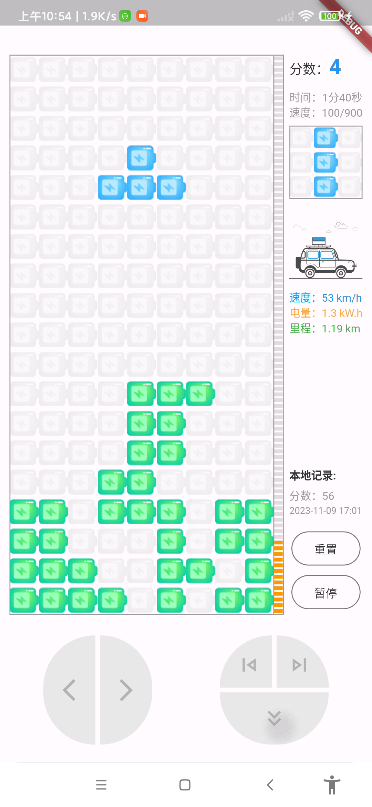
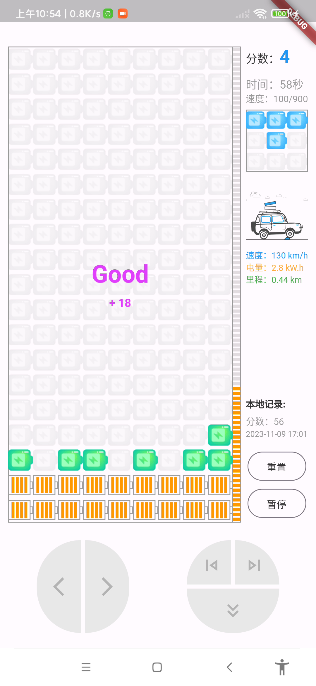

[中文](https://github.com/yujiaowangzi/flutter_tetris)

# Based on flutter's Tetris game about charging your car

The game features and UI are relatively perfect. The page is suitable for devices of arbitrary size, supporting Android,window, and other devices can compile and run by themselves  
 

# Theme

The theme of the game is "Charging the car", when the battery is lined up, it can transmit electricity to the car, the car will run (play car animation), the speed is related to the amount of power reserve, the driving process will consume electricity, the faster the speed will consume electricity faster, real-time record mileage, so the game performance is not only a score, It also tests whether the player can recharge the battery before it runs out and go as far as possible.

# Operation
There are touch screen virtual keys and keyboard operations

